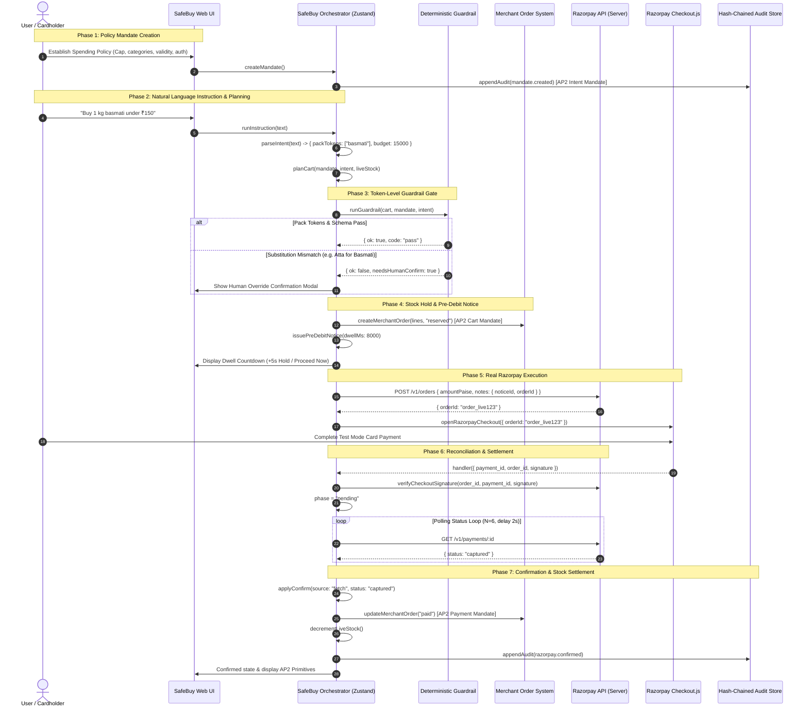

# SafeBuy System Architecture

## Overview
SafeBuy establishes a deterministic governance and safety layer around an autonomous AI agent to make merchant stores safely transactable under Indian payment regulations.

---

## 1. AP2 Primitives & Merchant Lifecycle

---

## 2. Core Invariants

1. **Token-Level Intent Verification:** The deterministic guardrail strictly validates that user search tokens (e.g. `basmati`) are represented in candidate items, blocking silent same-category substitutions.
2. **Merchant Order Lifecycle:** Every purchase creates a `MerchantOrder` that reserves catalog stock before the pre-debit notice window and settles or releases inventory deterministically.
3. **Durable Pre-Debit Notice:** `PreDebitNotice` records timestamp thresholds (`executeAfter`) providing the required regulatory notice window before payment APIs execute.
4. **Order-Gated Execution:** Razorpay Checkout strictly requires a server-created `order_id`.
5. **Reconciliation-Gated Mandate Decrement:** Mandate spending balances decrement only when backend Fetch or Webhooks report `status === "captured"`.
6. **Strict Idempotency:** Duplicate payment events are deduplicated via `confirmedPaymentIds`.
