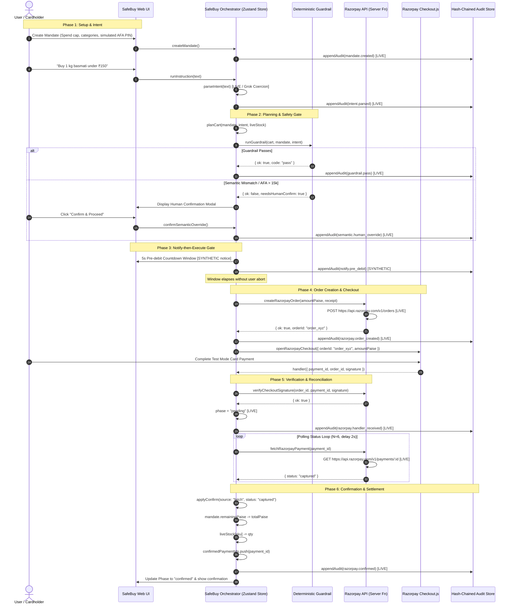

# SafeBuy System Architecture

## Overview
SafeBuy establishes a safe execution container around an autonomous AI agent to make merchant stores transactable under Indian financial regulations.

---

## 1. End-to-End Execution Sequence

---

## 2. Security & Idempotency Invariants

1. **Mandate Immutability:** Mandate limits cannot be overridden by raw LLM output or prompt injections. The guardrail diffs strongly-typed numeric and category schemas.
2. **Order-Gated Execution:** No Checkout UI can open without an existing server Order ID (`order_id`).
3. **Status-Gated Mandate Decrement:** The client handler never decrements the mandate directly. Mandate balances change only when backend Fetch or Webhooks report `status === "captured"`.
4. **Strict Idempotency:** The global `confirmedPaymentIds` tracking table prevents duplicate webhook deliveries or double-submitted handlers from charging the mandate twice.
5. **Cryptographic Chain:** Every audit entry calculates `SHA-256(prevHash + "|" + canonicalJson(body))` ensuring tampering detection.
